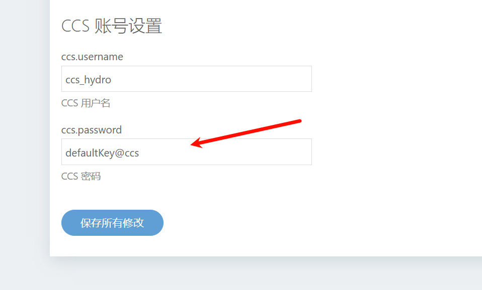
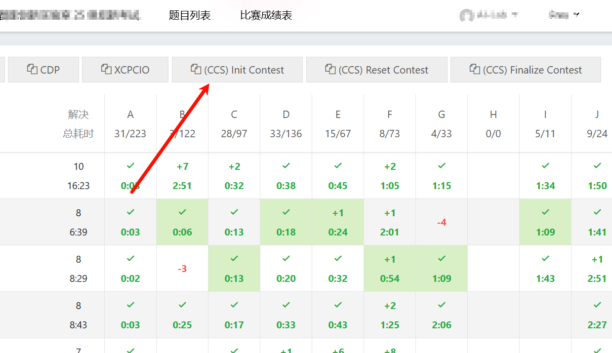
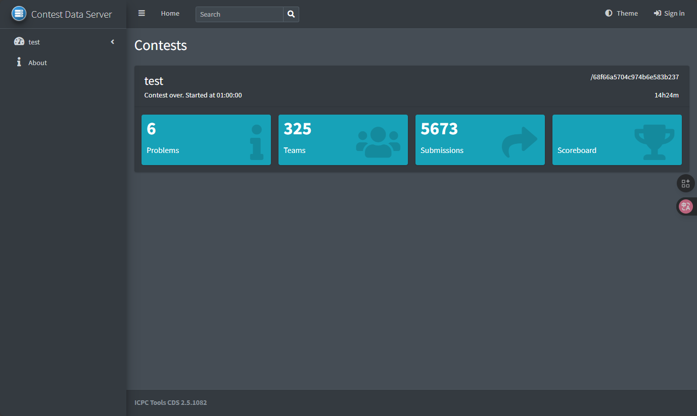
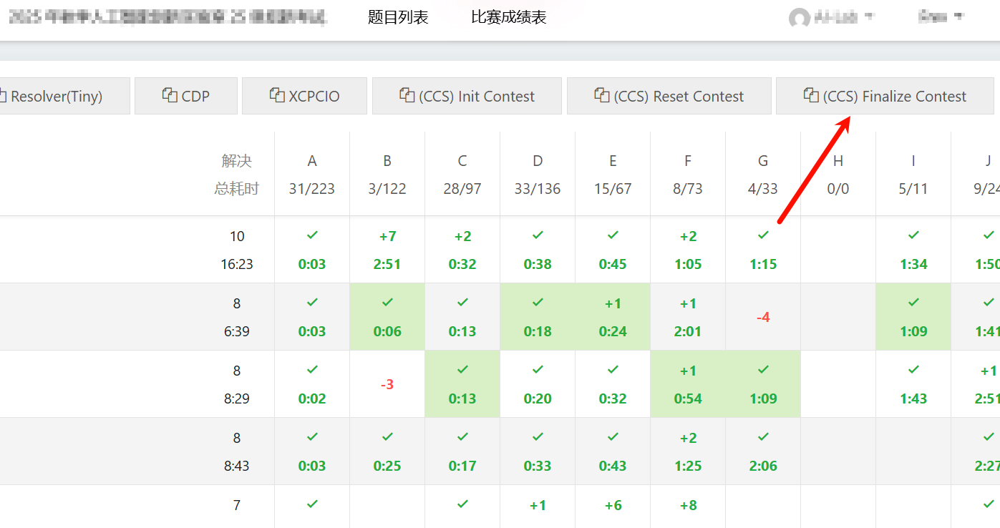

# hydrooj-plugin-ccs

为 HydroOJ 中的 ACM/ICPC 赛制比赛添加部分 CCS(Contest Control System) API 支持

## 已支持

- `/api`
- `/api/contests`
- `/api/contests/<contestId>`
- `/api/contests/<contestId>/state`
- `/api/contests/<contestId>/access` (静态)
- `/api/contests/<contestId>/languages` (静态)
- `/api/contests/<contestId>/problems`
- `/api/contests/<contestId>/teams`
- `/api/contests/<contestId>/organizations`
- `/api/contests/<contestId>/groups` (静态)
- `/api/contests/<contestId>/judgement-types` (静态)
- `/api/contests/<contestId>/submissions`
- `/api/contests/<contestId>/judgements`
- `/api/contests/<contestId>/event-feed` (支持 `stream` 和 `sinceToken` 查询参数)

## 未支持

- Runs 接口
- Webhook 接口
- Clarifications 接口
- Organization 的 Logo 获取
- 所有 POST / PUT / PATCH 接口

## 未计划支持

- Awards 接口
- Persons 接口
- Accounts 接口
- Commentary 接口

## How to use

### 赛前

- 安装本插件到你的 Hydro OJ 并重启 Hydro OJ
- 创建好 ACM/ICPC 赛制比赛，并将时间、题目、队伍等等一系列赛前设置全部设置完善，保持在随时可以开始比赛的状态即可。
- 比赛过程中如果需要对题目、队伍、时间做出操作增删改操作，请在操作后重置比赛 CCS 数据并重新初始化，否则不推荐赛时对这些数据进行任何改动。

> [!CAUTION]
> 如果比赛中途重新初始化比赛，请停止 CDS 并清除 CDS 缓存后重新启动 CDS 服务器，否则 CDS 会出现数据丢失的情况。

- 进入 “系统设置” 修改 CCS 账户的默认密码：

- 随后创建一个具有 “修改系统设置” 和 “创建比赛” 权限的账号作为操作 CCS 插件的账号，如果担心系统其他设置被篡改，可以仅授予 “创建比赛” 的权限，若需要修改 CCS 账户密码，则联系管理员用户。

### 赛时

- 比赛开始后，进入 “比赛成绩表” 中，点击 “(CCS) Init Contest” 按钮初始化比赛 CCS 数据：

- 使用 ICPC Tools CDS 连接 CCS，CCS URL 格式为：  
`http(s)://<domain>/ccs/api/contests/<ContestId>`
- 如果你的比赛在特定的域中，那么预期的 URL 格式应为：  
`http(s)://<domain>/d/<domainId>/ccs/api/contests/<ContestId>`

- 若没有问题，CDS 将会按预期正常工作。

> [!TIP]
> 比赛 ID 的获取就在你进入比赛后的 URL 里：`http(s)://xxxx/contest/68ead09f61ab6063d9fcd417`
>
> 形如上面的 URL 中，比赛 ID 就是 `68ead09f61ab6063d9fcd417`

### 赛后

待队列中的所有提交都已评测完毕，且之后没有重测计划，进入 “比赛成绩表” 中，点击 “(CCS) Finalize Contest” 对比赛数据进行锁定：

## 注意事项

在任何阶段如果出现了比赛数据混乱，进入 “比赛成绩表” 中，点击 “(CCS) Reset Contest” 对比赛 CCS 数据进行重置。随后再点击 “(CCS) Init Contest” 重新初始化比赛 CCS 数据，重新连接 CDS 即可。

> [!CAUTION]
> 注意此操作会将此比赛的 CCS Events 以及数据全部清空，重新初始化后按预期会恢复目前比赛已有的所有事件。

## Development

- Clone this repo into your workspace
- Enter your workspace for the repo's root dir
- Run `yarn` to install deps
- Run `yarn run lint` to lint your code

## PRs welcome ~